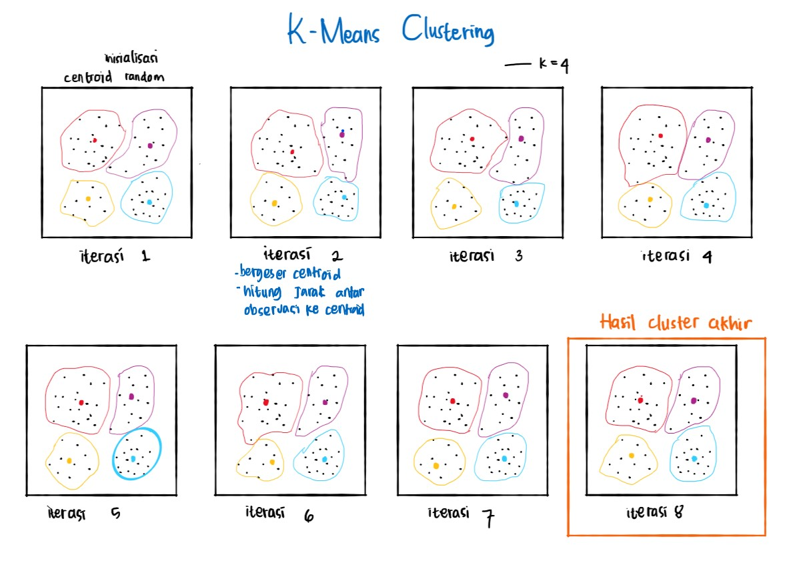

<style>

body {
text-align: justify}

</style>

```{r setup, include=FALSE}
# clear-up the environment
rm(list = ls())

# chunk options
knitr::opts_chunk$set(
  message = FALSE,
  warning = FALSE,
  fig.align = "center",
  comment = "#>"
)

options(scipen = 999)
```

```{r}
library(dplyr)
```


<style>

body {
text-align: justify}

</style>

# Introduction
Machine learning bertujuan untuk membuat mesin yang belajar berdasarkan data. Machine learning terbagi dua:

**1. Supervised Learning**: 

* Memiliki target variable. 
* Tujuan: membuat model prediksi dengan training data.
* Model di-evaluasi dengan testing data (karena memiliki target variable)

**2. Unsupervised Learning**: 

* Tidak memiliki target variable. 
* Tujuan: mencari pola dalam data, yang berguna untuk menghasilkan informasi. Digunakan pada tahap pre-processing maupun Exploratory Data Analysis (EDA).
* Tidak ada target variable sehingga tidak ada evaluasi model  


Dalam studi kasus ini, kita akan menggunakan metode **unsupervised learning** lebih tepatnya Clustering dengan KMeans, di mana variabel target tidak diketahui atau ditentukan.


# Clustering
> Teknik yang digunakan untuk mengelompokkan data berdasarkan kemiripan atau karakteristik tertentu. 

Clustering bertujuan untuk menghasilkan cluster dimana:

- Observasi di satu cluster yang sama yang memiliki karakteristik yang mirip
- Observasi dari cluster yang berbeda memiliki karakteristik yang berbeda

## K-Means
> K-means adalah *centroid-based* clustering algorithms, artinya tiap cluster memiliki satu titik pusat (centroid) yang mewakili cluster tersebut.

K-means merupakan proses yang berulang dari:

1. **Random initialization**: meletakkan $k$ centroid secara random
2. **Cluster assignment**: assign masing-masing observasi ke cluster terdekat, berdasarkan perhitungan jarak
3. **Centroid update**: menggeser centroid ke rata-rata (means) dari cluster yang terbentuk
4. Ulangi langkah 2 dan 3 sampai tidak ada observasi yang clusternya berubah lagi

Note: Banyaknya cluster $k$ ditentukan oleh user.

```{r, out.width = "70%", echo = FALSE, fig.align = "center"}

```

### K-means Workflow

#### Business Question: Whiskey Recommendation

Kita sebagai seorang data scientist sebuah toko whisky diminta untuk membuat product recommendation untuk whisky berdasarkan preferensi rasa masing-masing customer!

> Tujuan: membentuk kelompok whisky yang memiliki karakteristik rasa khas pada tiap clusternya

Data yang digunakan berupa data penyulingan Malt Whisky dari 86 pabrik penyulingan, diperoleh dari penelitian Dr. Wisehart (Universitas St. Andrews). Setiap whisky diberi skor 0-4 dari 12 kategori cita rasa berdasarkan uji organoleptik: 

Sumber: https://github.com/sweis/whiskies/blob/master/whiskies.txt

* Body: tingkat kekuatan rasa (light/heavy)
* Sweetness: tingkat rasa manis
* Smoky: tingkat rasa asap
* Medicinal: tingkat rasa pahit (obat)
* Tobacco: tingkat rasa tembakau
* Honey: tingkat rasa madu
* Spicy: tingkat rasa pedas
* Winey: tingkat rasa anggur
* Nutty: tingkat rasa kacang
* Malty: tingkat rasa gandum
* Fruity: tingkat rasa buah
* Floral: tingkat rasa bunga

#### Read Data 

```{r}
whisky <- read.csv("whiskies.txt")
glimpse(whisky)
```
note: k-means hanya bisa dilakukan pada data dengan tipe data numerik 

Cleansing data

```{r}
# meng-assign nilai dari kolom Distillery menjadi rownames
rownames(whisky) <- whisky$Distillery

# membuang kolom yang tidak digunakan
whisky_clean <- whisky %>% 
  select(-c(RowID,Distillery,Postcode,Latitude,Longitude))
whisky_clean
```

#### EDA & Scaling

Cek missing values
```{r}
# cek NA
anyNA(whisky_clean)
```

Cek skala antar variabel
```{r}
summary(whisky_clean)
```

Note: jika bertemu data dengan skala yang berbeda tetap harus discale

Pada data `whisky`, apakah skala nilai antar variable berbeda? Apakah perlu dilakukan scaling? Tidak.
Karena data whisky sudah punya skala yang sama di tiap kolomnya yaitu skor 0-4


#### K-means

formula = `kmeans(x, centers)`

Parameter:

- `x`: dataset
- `centers`: banyaknya centroid $k$ (banyaknya kelompok yang diinginkan)

Note: perlu dilakukan `set.seed()` karena terdapat random initialization pada tahap awal k-means

```{r}
RNGkind(sample.kind = "Rounding")
set.seed(100)

whiz_cluster <- kmeans(whisky_clean,centers = 3) #kita mau coba buat 3 cluster
```

**Hasil k-means:**

* 1️⃣ Banyaknya observasi pada tiap cluster

```{r}
# jumlah data tiap cluster
whiz_cluster$size
```

* 2️⃣ Letak pusat cluster/centroid, biasa digunakan untuk profiling cluster
```{r}
# letak pusat cluster atau centroid
whiz_cluster$centers
```


* 3️⃣ Label cluster untuk tiap observasi
```{r}
# hasil clustering (label cluster untuk tiap observasi)
as.data.frame(whiz_cluster$cluster)
```

* 4️⃣ Banyaknya pengulangan (iterasi) algoritma k-means sampai dihasilkan cluster yang stabil
```{r}
# berapa kali pengulangan sampai menghasilkan kelompok yang stabil
whiz_cluster$iter
```

#### Goodness of Fit

Kebaikan hasil clustering dapat dilihat dari 3 nilai:

1. Within Sum of Squares (`$withinss`): jumlah jarak kuadrat dari tiap observasi ke centroid tiap cluster.
2. Between Sum of Squares (`$betweenss`): jumlah jarak kuadrat terbobot dari tiap centroid ke rata-rata global. Dibobotkan berdasarkan banyaknya observasi pada cluster.
3. Total Sum of Squares (`$totss`): jumlah jarak kuadrat dari tiap observasi ke rata-rata global.

```{r}
# cek nilai wss
whiz_cluster$withinss
whiz_cluster$tot.withinss
```

```{r}
# cek nilai bss
whiz_cluster$betweenss

# cek nilai tss
whiz_cluster$totss
```

```{r}
# cek rasio bss/tss
whiz_cluster$betweenss/whiz_cluster$totss
```
Insight: cluster yang dihasilkan ternyata kurang bagus, karena rasio bss/tss jauh dari 1

**Clustering yang baik:**

- WSS semakin **rendah**: jarak observasi di 1 kelompok yang sama semakin rendah, artinya tiap cluster memiliki karakteristik yang semakin mirip
- $$\frac{BSS}{TSS} ≈ 1$$, karena kelompok hasil clustering semakin mewakili persebaran data yang sesungguhnya

Sekarang, kita coba modeling k-means dengan $k$ sebesar mungkin, misalnya 80. Kemudian cek WSS dan BSS/TSSnya, kita akan lihat apakah clustering yang terbentuk dapat dikatakan ideal atau tidak

```{r, warning=FALSE}
# buat model kmeans
RNGkind(sample.kind = "Rounding")
set.seed(100)

whiz_cluster80 <- kmeans(whisky_clean,centers = 80)
```

```{r}
# hitung rasio bss/totss
whiz_cluster80$betweenss/whiz_cluster80$totss
```

💡 Insight: Ternyata semakin besar nilai k (jumlah kelompok) yang dihasilkan, maka bss/tss nya semakin mendekati 1

```{r}
# cek nilai wss
whiz_cluster80$withinss
```

💡 Insight: WSS nya jadi banyak yang nol, karena banyak cluster yang anggotanya cuma 1 (centroid itu sendiri). Namun, kita tidak mau cluster yang seperti ini karena tujuan clustering hilang


Berdasarkan percobaan diatas, maka:

* Pemilihan k (banyaknya cluster) sangat mempengaruhi performa clustering
* Pemilihan banyak k akan membuat bss/tss bagus, namun tidak representatif karena bisa jadi ada satu cluster yang beranggotakan satu observasi sendiri (tujuan clustering tidak tercapai)

#### Pemilihan `K` Optimum

Semakin tinggi $k$: 

- WSS semakin mendekati 0
- BSS semakin mendekati TSS (atau BSS/TSS mendekati 1)

Kalau begitu apakah kita selalu memilih $k$ = banyak observasi? Bagaimana menentukan $k$ optimum?

- Kebutuhan dari segi bisnis, dibutuhkan menjadi berapa kelompok
- Secara objektif: Elbow method, visualisasi dengan `fviz_nbclust()`

**Elbow Method**
> Elbow Plot merupakan plot antara banyak klaster dengan total dari simpangan/variasi per kluster (total WSS).

Note: Banyak klaster yang dipilih adalah bagian “siku” atau titik dimana terdapat penurunan yang tajam sebelum titik tersebut dan disusul penurunan yang tidak tajam setelah titik tersebut. Hal ini karena penambahan jumlah klaster tidak membawa pengaruh banyak atas variasi yang ada di dalam klaster tersebut.

```{r}
library(factoextra)

fviz_nbclust(
  x = whisky_clean, #data untuk clustering
  FUNcluster = kmeans, #algoritma kmeans
  method = "wss" #berdasarkan wss
)
```

Pilih nilai `k` dimana ketika `k` ditambah, penurunan `total within sum of squares` tidak terlalu drastis (atau dapat dikatakan sudah melandai)

💡 K optimum dari data whisky adalah 5

Kontruksi kembali k-means clustering menggunakan k optimum

```{r, warning=FALSE}
RNGkind(sample.kind = "Rounding")
set.seed(100)

# k-means dengan k optimum
whisky_cluster_op <- kmeans(whisky_clean,centers = 5)

# WSS
whisky_cluster_op$tot.withinss #5 cluster
whiz_cluster$tot.withinss #3 cluster

# BSS/TSS
whisky_cluster_op$betweenss/whisky_cluster_op$totss
```

```{r}
# Cek berapa besar tiap cluster
whisky_cluster_op$size
```

#### Interpretation: Cluster Profiling

Membuat kolom baru yang berisikan informasi label dari cluster yang terbentuk menggunakan k optimum
```{r}
whisky_clean$cluster <- as.factor(whisky_cluster_op$cluster)
```

```{r}
# Cek head data
head(whisky_clean)
```

**Grouping data based on cluster label**

Melakukan grouping berdasarkan cluster yang terbentuk, untuk mengetahui karakteristik dari masing-masing cluster
```{r}
as.data.frame(whisky_cluster_op$centers)
```


```{r}
# melakukan profiling cluster dari data asli (supaya nantinya jika ketemu dengan perlu data yg perlu discaling sebelum kmeans nya , interpretasinya tidak salah)
whisky_centroid <- whisky_clean %>% 
  group_by(cluster) %>% 
  summarise_all(mean)
whisky_centroid
```

⚙️ Mempermudah profiling: tabel yang menampilkan cluster dengan nilai terendah dan tertinggi untuk masing-masing karakteristik whisky
```{r}
library(tidyr)

whisky_centroid %>% 
  pivot_longer(-cluster) %>% 
  group_by(name) %>% 
  summarize(
    kelompok_min = which.min(value),
    kelompok_max = which.max(value))
```

💡 Profiling tiap cluster

**Cluster 1** :

  - Paling tinggi di cita rasa : Fruity, Honey, Nutty, winey
  
  - Paling rendah di cita rasa : Medicinal, Tobacco
  
  - Label : Fruity whisky


**Cluster 2** :

  - Paling tinggi di cita rasa : Body, Medicinal, Smoky, Tobacco
  
  - Paling rendah di cita rasa : Floral, Malty, Sweetness, Honey
  
  - Label : Bitter whisky

**Cluster 3** :

  - Paling tinggi di cita rasa : Floral
  
  - Paling rendah di cita rasa : Body
  
  - Label : Floral whisky
  
  
**Cluster 4** :

  - Paling tinggi di cita rasa : -
  
  - Paling rendah di cita rasa : Fruity
  
  - Label : Mediocore whisky
  
**Cluster 5** :

  - Paling tinggi di cita rasa : Spicy, Sweetness
  
  - Paling rendah di cita rasa : -
  
  - Label : Spicy & Sweetness whisky


⚙️Untuk mempermudah profiling kita akan membentuk grafik yang mengurutkan cita rasa pada setiap cluster
```{r}
whisky_centroid %>% 
  pivot_longer(-cluster) %>%
  ggplot(aes(x = value, y = tidytext::reorder_within(name, value, cluster), fill = value)) +
  geom_col() +
  scale_fill_gradient(low = "pink", high = "navy") +
  facet_wrap(~cluster, scales = "free_y") +
  theme_minimal() +
  labs(title = "Cita rasa tiap Cluster",
       y = "",
       x = "Skor")
```


### Case: Product Recommendation

Misal ada seorang pelanggan pecinta whisky "Laphroig" datang ke toko kita, namun stok whisky tersebut sedang kosong. Kira-kira whisky apa yang akan kita rekomendasikan?

* Identifikasi whisky "Laphroig" terdapat di cluster berapa
```{r}
# your code here
whisky_clean["Laphroig",]
```

* Memanggil whisky yang satu cluster dengan "Laphroig"
```{r}
whisky_clean[whisky_clean$cluster==2,]
```

💡 Solusi: Silakan rekomendasikan merk whisky lain yang ada di cluster 2


